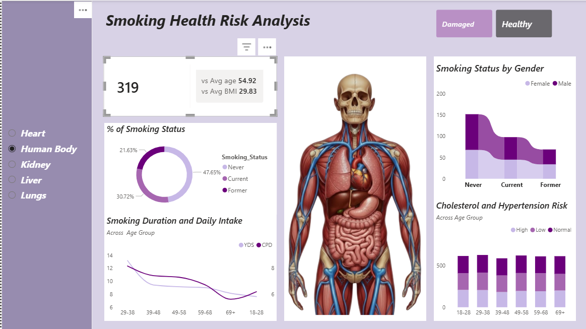

# Smoking-Health-Risk-Analysis
Smoking health risk analysis using, Excel, PowerBI, Power Query and DAX

---
## 📌 Overview

The Smoking Health Risk Analysis Dashboard is an interactive Power BI dashboard that explores the relationship between smoking habits and key health risk factors. The dashboard provides a comprehensive view of smoking behavior across different demographic groups, enabling users to identify trends, assess health risks, and make informed, data-driven decisions.

By analyzing variables such as smoking status, age, gender, BMI, smoking duration, daily cigarette consumption, cholesterol, and hypertension risk, the dashboard highlights how lifestyle choices can influence overall health outcomes. Interactive visualizations and filters allow users to explore the data from multiple perspectives, making it easier to identify high-risk populations and uncover meaningful insights.

---

## 🎯 Objectives
- Analyze smoking patterns across different demographic groups.
- Identify the relationship between smoking and health risk factors.
- Compare smoking behavior by age and gender.
- Monitor smoking duration and daily cigarette consumption.
- Evaluate cholesterol and hypertension risk across age groups.
- Support healthcare decision-making through interactive data visualization.

 ## 📊 Dashboard Features
- KPI Cards
- Total Individuals Analyzed
- Average Age Comparison
- Average BMI Comparison

## 🛠️ Tools & Technologies
- Power BI
- Power Query
- DAX (Data Analysis Expressions)
- Microsoft Excel

---

## 📈 Key Insights
- Smoking prevalence differs across age groups and gender.
- Long-term smoking is associated with increased health risks.
- Cardiovascular risk factors such as hypertension and high cholesterol become more common with age.
- Interactive filtering helps identify trends across different body systems and patient groups.

---

📌 Business Recommendations
- Strengthen Smoking Cessation Programs
- Focus on High-Risk Age Groups
- Promote Preventive Healthcare
- Prioritize Cardiovascular Risk Management
- Implement Personalized Health Education

---

**Dashboard Preview**

 
